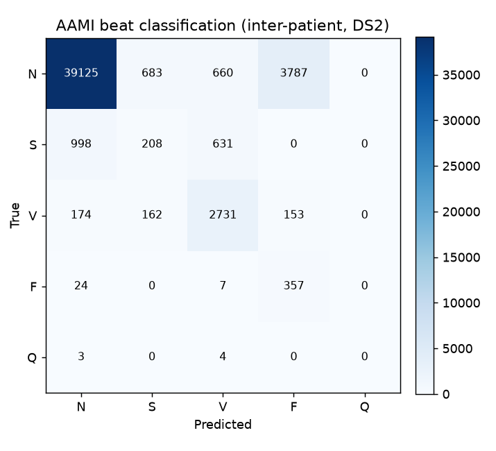

# ecg-mcu — Real-Time Arrhythmia Detection on a Microcontroller

A single-lead ECG pipeline that filters the signal, detects R-peaks with a hand-implemented **Pan–Tompkins** algorithm, and reports heart rate **in real time on an STM32 Nucleo-F411RE (Cortex-M4F)** — validated against the MIT-BIH Arrhythmia Database. A browser dashboard (Web Serial + Next.js) renders the live trace with an original **live P-Q-R-S-T morphology callout**.

> ⚠️ **Not a medical device.** This is an engineering portfolio project. Nothing here is intended for diagnosis, monitoring, or any clinical use.


*Live trace on a chart-recorder sweep; the P, Q, R, S, and T fiducials are located on the actual waveform and labelled as each beat settles.*

---

## Why this project is different

Most hobby ECG projects run a classifier in batch on a laptop and report a single accuracy number. This one is built the way the field actually cares about:

- **Real-time on hardware, not batch on a laptop.** The detector runs on the MCU itself, fed by a timer-driven feed through a ring buffer. Measured on-device via the DWT cycle counter, worst-case compute latency is **166.7 µs/sample — 6.0% of the 2777 µs budget at 360 Hz, roughly 300× under the 50 ms target.**
- **Correct inter-patient evaluation.** Training and test use *different* patients (the de Chazal DS1/DS2 split). Naive per-beat splits leak the same patient into both sets and inflate accuracy; the patient-independent split is the honest way to measure generalization.
- **Live morphology, not just peak-picking.** The dashboard's PQRST callout locates all five fiducials by snapping to the real local extrema in the buffered samples around each detected R-peak — a live version of the textbook ECG diagram, reading the actual signal.

*(Phase 2 adds a fourth: a head-to-head comparison of the classical detector vs. a quantized on-device neural net — accuracy, latency, and flash/RAM footprint on the same board.)*

---

## How it works

**Signal pipeline.** Raw single-lead ECG → band-pass filter (~5–15 Hz, the band that maximizes QRS energy) → Pan–Tompkins (derivative → squaring → moving-window integration → adaptive thresholds) → R-peak train → instantaneous heart rate from R-R intervals, smoothed over the last few beats.

**Real-time architecture on the MCU.** A hardware timer (TIM2) paces sampling at 360 Hz. Samples land in a 64-slot **ring buffer** so acquisition and processing never touch the same slot; the main loop drains the buffer through the detector. Each detected peak and each raw sample stream out over the ST-LINK virtual COM port. The same detector code runs bit-identically on a laptop (`c-reference/`) and on the board, which is how the port was de-risked before any hardware was involved.

**The dashboard (`dashboard/`).** A Next.js app connects to the board over the **Web Serial API** and parses two line types:

```
S <int>                        one waveform sample (integer, unit-agnostic)
R-peak @ <idx>   inst BPM <n>   an R-peak with instantaneous heart rate
```

It draws a scrolling ECG trace on an ECG-paper grid, a large live BPM readout, and — as its signature — the live P-Q-R-S-T callout on the most recently settled beat. Because the Y axis autoscales, the same dashboard renders replay data (integer microvolts) and live ADC data (raw counts) with no code change. A built-in **Simulate** mode generates a synthetic beat so the whole UI can be demoed with no hardware attached.

---

## Results

### On-device, MIT-BIH record 100 (60 s @ 360 Hz, Nucleo-F411RE @ 84 MHz)

| Metric | Value |
|---|---|
| R-peak correctness | **72/72** peaks match the desktop C reference exactly (bit-verified via `Compare-Object`, not by eye) |
| Compute latency / sample | avg **43.2 µs**, worst **166.7 µs** (DWT cycle counter) |
| Real-time budget @ 360 Hz | 2777 µs/sample → **6.0% worst-case utilization**, ~300× under the 50 ms target |
| Timer-driven playback | **0 ring-buffer overflows**, wall clock 60003 ms vs 60000 expected (0.005% error) |
| Footprint | 190,788 B flash (36%; ~172.8 KB is the embedded ECG array, firmware itself ~18 KB), 2,096 B RAM (1.6%) |

*Compute latency (above) is distinct from algorithmic detection latency — the ~100–200 ms delay between the physical R-peak and its report, set by Pan-Tompkins' integration window and filter group delay. That is inherent to the algorithm, not the hardware, and wouldn't shrink on a faster MCU.*

### Beat classification (Stage 1.1, Python, inter-patient DS2)

Classification of MIT-BIH beats into the 5 AAMI classes using hand-crafted R-R + morphology features, evaluated on held-out patients (no patient appears in both train and test):



| Class | Sensitivity (recall) | PPV (precision) |
|---|---|---|
| N (normal) | 88.4% | 97.0% |
| S (supraventricular) | 11.3% | 19.8% |
| V (ventricular) | 84.8% | 67.7% |
| F (fusion) | 92.0% | 8.3% |
| Q (unknown) | 0% (n=7) | — |

Overall accuracy **85.3%** across 49,707 held-out beats. **N and V separate well on hand-crafted features; S and F do not** — which is precisely why Phase 2 replaces the classical classifier with a quantized 1D-CNN. The classical classifier stays in Python during Phase 1 and is ported to the MCU in Stage 2.3, where it becomes the baseline arm of the on-device classical-vs-NN comparison.

---

## Status

**Phase 1 — Classical pipeline, real-time on hardware**

- [x] **1.1** Offline pipeline in Python, validated on MIT-BIH (Pan–Tompkins + beat features, inter-patient split)
- [x] **1.2** Re-implemented in portable C, bit-compared against the Python reference
- [x] **1.3** Running on the STM32 from recorded data — timer + ring buffer at 360 Hz, on-device latency logged (DWT)
- [x] **1.4a** ADC + DMA sampling triggered by TIM2-TRGO at 360 Hz (verified)
- [x] **1.4b** AD8232 analog front-end wired; full electronics path proven *(awaiting fresh electrode pads for live capture)*
- [x] **1.4c** Live heart-rate math from R-R intervals, validated on replay
- [x] **1.4e** Web Serial dashboard + live PQRST callout
- [ ] **1.4d** Real-world noise handling (baseline wander, 60 Hz notch, motion) — needs the live signal
- [ ] **Live bring-up** — first ECG off a real electrode lead

**Phase 2 — On-device neural net + wearable** *(planned)*

- [ ] Train a compact 1D-CNN on segmented beats → AAMI classes
- [ ] Int8 quantization → deploy with LiteRT-for-Microcontrollers + CMSIS-NN
- [ ] Classical-vs-NN comparison (accuracy, latency, flash/RAM) on the same board
- [ ] Low-power wearable form factor (STM32L4) + rigorous evaluation

---

## Repository layout

```
arrhythmia-detection-mcu/
├── pipeline/         # Python: filters, Pan–Tompkins, beat features, validation
├── c-reference/      # portable C detector — runs on PC, bit-tested vs Python
├── firmware/         # STM32CubeIDE project (Nucleo-F411RE)
│   └── ecg-mcu/Core/Src/app_ecg.c   # replay modes, ring buffer, sample + peak streaming
├── dashboard/        # Next.js Web Serial dashboard (this checkpoint)
│   └── app/page.tsx  # the whole UI: trace, BPM, live PQRST callout, Simulate mode
└── docs/             # demo GIF, results, confusion matrix
```

---

## Running it

**Python pipeline**

```bash
# from pipeline/ — needs wfdb, numpy, scipy, matplotlib, scikit-learn
python run_stage1.py
```

**Firmware**

Open `firmware/ecg-mcu/` in STM32CubeIDE, build, and flash to the Nucleo-F411RE (onboard ST-LINK — no separate programmer needed). Open a serial monitor at **115200 baud** and choose a mode from the menu (mode 2 = timer-driven 360 Hz replay, which streams samples + R-peaks for the dashboard).

**Dashboard**

```bash
cd dashboard
npm install
npm run dev
# open the printed localhost URL in Chrome or Edge
```

- **Simulate** — synthetic ECG, no hardware required (great for a first look).
- **Connect board** — quit any other serial tool first (the COM port is single-owner), pick the STM32 port, and stream live.

> Web Serial is only available in Chromium browsers (Chrome / Edge), and only over `localhost` or HTTPS.

---

## Interview / talking points

- Why Pan–Tompkins band-passes to ~5–15 Hz, and how monitoring cutoffs (0.5 Hz high-pass, ~40 Hz low-pass) trade off against a wider diagnostic band.
- Real-time on embedded: timer-driven feed, ring buffer, DWT-measured latency — vs. the usual batch-on-a-laptop project.
- Compute latency vs. algorithmic detection latency, and why only one of them scales with MCU speed.
- Why patient-independent evaluation matters and how naive splits inflate accuracy.
- Single-lead limits (AD8232) and what multi-lead would take (e.g. ADS1298) — natural future work.

---

## Author

**Isaac Glenu** — Systems Design Engineering (Biomedical option), University of Waterloo.
[LinkedIn](https://www.linkedin.com/in/isaac-glenu7) · [GitHub](https://github.com/isaaac-afk)
