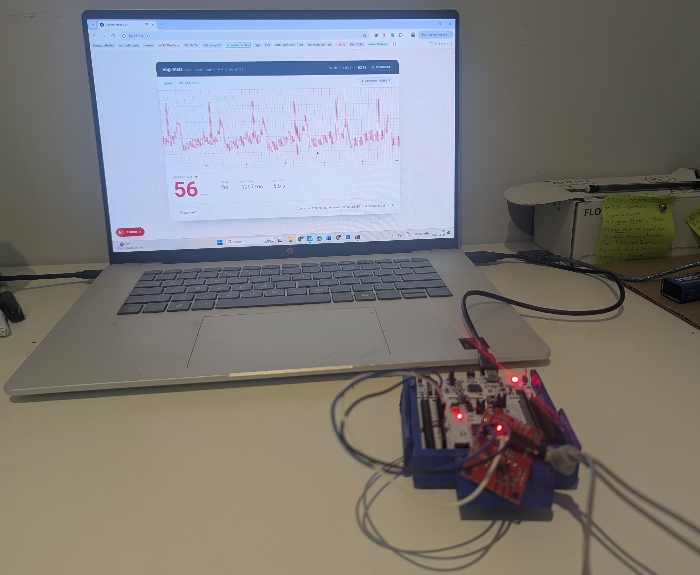
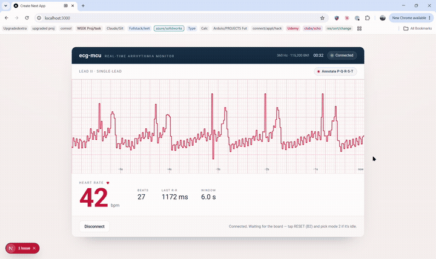
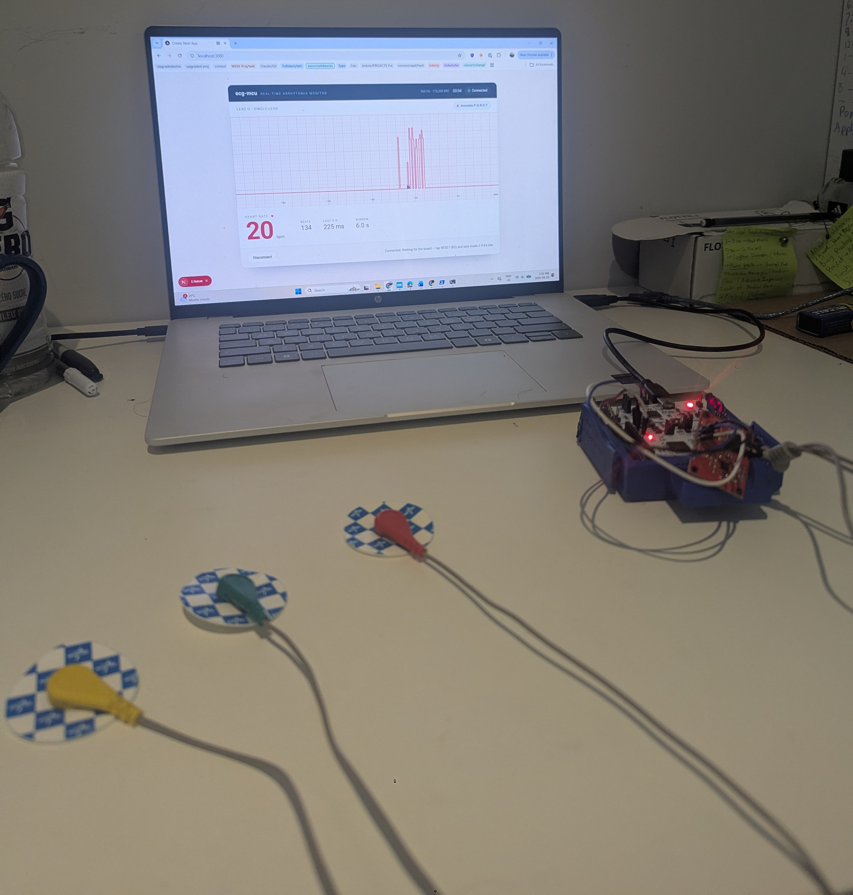

# ECG Arrhythmia Detection on STM32

> Real-time heartbeat detection and neural-net beat classification on a Cortex-M4 microcontroller, with a live Web Serial dashboard — from raw electrodes to on-device inference.

**Not a medical device.** This is a learning and portfolio project.



*Live ECG from my own heart, detected in real time on an STM32F411RE, displayed on a custom Web Serial dashboard with PQRST annotation.*

---

## What this project does

1. **Acquires a live single-lead ECG** from snap electrodes via an AD8232 analog front-end, sampled at 360 Hz by the STM32's ADC+DMA.
2. **Detects every heartbeat in real time** using an adaptive Pan–Tompkins R-peak detector running on the Cortex-M4 (~38 µs/beat, well within the 2.78 ms real-time budget).
3. **Classifies each beat** into one of 5 AAMI arrhythmia classes (Normal, Supraventricular, Ventricular, Fusion, Unknown) using a compact 1-D CNN with RR-timing inputs, trained on the MIT-BIH Arrhythmia Database with a proper inter-patient evaluation split.
4. **Streams the trace to a live Web Serial dashboard** (Next.js) with real-time BPM, elapsed time, and optional PQRST morphology annotation.




### Live signal proof

The system reads a real biological signal — removing the reference electrode immediately disrupts the trace, confirming the dashboard displays a live signal, not a replay:



---

## Key results

### Classical vs. neural-net head-to-head (STM32F411RE @ 84 MHz)

| | Pan–Tompkins detector | RR-augmented CNN classifier |
|---|---|---|
| **Task** | R-peak detection | 5-class AAMI beat classification |
| **Accuracy (DS2)** | 72/72 R-peaks on rec. 100 | 91.1% (int8) / 92.3% (float) |
| **vs. RandomForest** | — | RF 85.3% → CNN wins on N, S, V |
| **On-device latency** | ~38 µs/beat | 85 ms/beat (−O2) |
| **Flash** | ~18 KB | +36.6 KB |
| **RAM** | ~2 KB | +32 KB scratch |
| **Runs inline at sample rate?** | Yes | No — must decouple (see below) |

### Per-class comparison (Se / PPV on inter-patient DS2)

| Class | RandomForest | CNN baseline | CNN + RR timing |
|---|---|---|---|
| N (normal) | 88.4 / 97.0 | 77.0 / 96.9 | **96.2 / 96.9** |
| S (supraventricular) | 11.3 / 19.8 | 2.8 / 3.4 | **16.7 / 61.2** |
| V (ventricular) | 84.8 / 67.7 | 90.9 / 27.7 | **93.3 / 60.2** |
| F (fusion) | 92.0 / 8.3 | 0.5 / 0.1 | 0.5 / 0.7 |

The raw-window CNN beat the RandomForest on ventricular beats but collapsed on supraventricular (S) — because S beats are defined by their *timing* (premature RR), which a fixed window throws away. Adding two RR-timing inputs (prev\_RR and RR\_ratio) recovered S recall from 2.8% → 16.7% at 61% precision. F (fusion) is a known dataset hard-limit — only 388 examples in all of MIT-BIH.

### The decoupling finding

The CNN is ~2,200× heavier per invocation than the detector. Running it inline in the 360 Hz sample loop overflows the ring buffer (3,905 samples dropped in a 60 s record). The correct architecture runs the lightweight detector on every sample and schedules the CNN at beat-rate (~1 Hz) off the critical path — at 85 ms inference against an ~830 ms beat interval, there is ~10× headroom.

---

## Architecture

```
Electrodes → AD8232 → STM32 ADC (360 Hz, DMA+TIM2 TRGO)
                         ↓
                    Ring buffer (64-slot, ISR-fed)
                         ↓
               Pan–Tompkins detector (~38 µs/sample)
                    ↓              ↓
              R-peak index    Stream "S <val>" to dashboard
                    ↓
           Beat window (252 samples) + RR features
                    ↓
           Float CNN classifier (85 ms/beat, −O2)
                    ↓
              AAMI class (N/S/V/F/Q) + BPM
```

---

## Project structure

```
pipeline/           Python ML pipeline
  ├── pan_tompkins.py         Adaptive R-peak detector
  ├── classify.py             RandomForest baseline (Stage 1.1)
  ├── train_cnn.py            1-D CNN baseline (Stage 2.1)
  ├── train_cnn_rr.py         RR-augmented CNN (Stage 2.1b)
  ├── quantize_cnn.py         Int8 post-training quantization (Stage 2.2)
  ├── extract_weights.py      Export float weights → C header
  ├── dump_deploy_constants.py  Quantization params → C header
  ├── noise_filters.py        Baseline-wander HP + 60 Hz notch design/validation
  ├── data_loader.py          MIT-BIH loading + AAMI mapping + de Chazal split
  ├── filters.py / features.py / evaluate_detection.py
  └── ...
firmware/ecg-mcu/   STM32CubeIDE project (Nucleo-F411RE)
  └── Core/
      ├── Src/app_ecg.c       Main application: menu, live/replay modes, detection, BPM
      ├── Src/beat_cnn.c       Hand-written float CNN inference (verified vs Keras)
      ├── Src/detector.c       Portable C Pan–Tompkins detector
      ├── Inc/beat_cnn.h
      ├── Inc/model_weights.h  Float weights (~32 KB)
      ├── Inc/model_config.h   Deployment constants (quantization params, RR stats)
      └── Inc/ecg_data.h       Embedded MIT-BIH record for replay/validation
c-reference/        Portable C detector + biquad filters (host-testable)
dashboard/          Next.js Web Serial dashboard
  └── app/page.tsx  Live ECG trace, BPM, PQRST annotation, simulate mode
docs/               Results, confusion matrices, screenshots
models/             Trained models (gitignored — regenerate with pipeline/)
```

---

## Stages

| Tag | Stage | What it proved |
|---|---|---|
| — | 1.1 | Python Pan–Tompkins + AAMI RandomForest (85.3% inter-patient) |
| — | 1.2 | Portable C detector, bit-verified vs Python |
| — | 1.3 | Real-time on STM32: 72/72 peaks, 43 µs avg, 0 ring overflows |
| v1.4e | 1.4 | Live ADC, AD8232 wiring, Web Serial dashboard, noise filters |
| — | 2.1 | Raw-window CNN baseline; 2.1b added RR timing → S recall 6× up |
| — | 2.2 | Int8 quantization: 92.3% → 91.1%, 167 KB → 25 KB |
| v2.3 | 2.3 | On-device float inference, 85 ms/beat (−O2), head-to-head measured |
| — | Live | Live ECG from own heart, detected + displayed on dashboard |

---

## Hardware

- **MCU:** STM32 Nucleo-F411RE (Cortex-M4F @ 84 MHz, 512 KB flash, 128 KB RAM)
- **AFE:** SparkFun AD8232 single-lead heart rate monitor
- **Electrodes:** Snap-style foam ECG pads (any brand — Kendall 530, Medline, etc.)
- **Connection:** AD8232 OUTPUT → PA0, 3.3V → 3V3, GND → GND (3 wires, soldered)

## Software

- **Firmware:** C (GCC arm-none-eabi), STM32CubeIDE 2.2.0, HAL drivers
- **ML pipeline:** Python 3.11, TensorFlow/Keras 2.21, scikit-learn, wfdb
- **Dashboard:** Next.js 16, Web Serial API, TypeScript
- **On-device inference:** Hand-written float C engine, verified bit-close to Keras (max diff 1.19e-7)

---

## Quick start

### Run the dashboard on replay (no hardware needed)
```bash
cd dashboard && npm install && npm run dev -- --webpack
# Open localhost:3000 → click "Simulate" for synthetic PQRST,
# or connect the board and pick mode 2 for MIT-BIH replay.
```

### Train the CNN from scratch
```bash
pip install tensorflow scikit-learn wfdb matplotlib
python -m pipeline.train_cnn_rr        # trains on MIT-BIH DS1, evaluates on DS2
python -m pipeline.quantize_cnn        # int8 quantization + accuracy comparison
```

### Flash and run live
1. Open `firmware/ecg-mcu/` in STM32CubeIDE, build, drag `.bin` onto NOD\_F411RE.
2. Attach AD8232 + electrodes (see Hardware above).
3. Open the dashboard, connect, reset the board — mode 6 runs live by default.

---

## License

Apache 2.0
