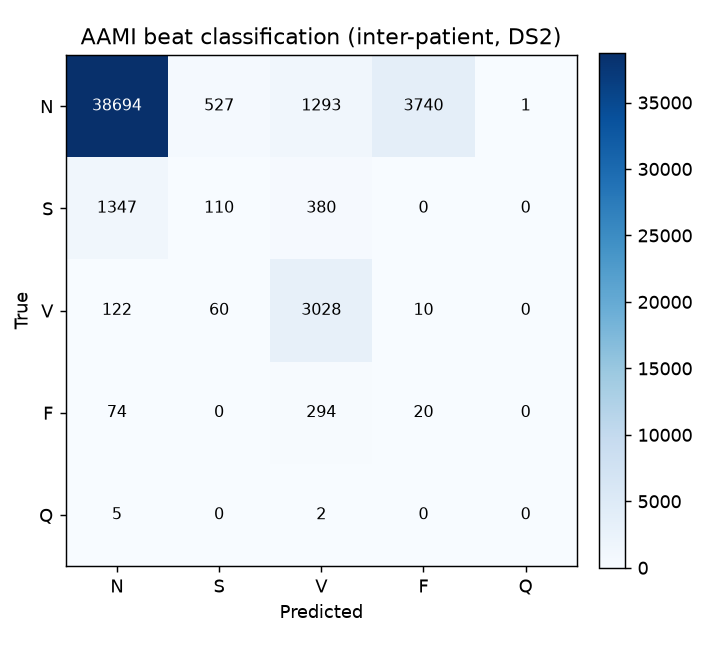

# Results

## Classification (Stage 1.1)

Inter-patient split (de Chazal): trained on DS1 (22 patients), tested on DS2 (22 different patients). Features from annotated R-peaks; RandomForest, class-balanced.

- Train beats: 51017
- Test beats: 49707



```
              precision    recall  f1-score   support

           N      0.962     0.874     0.916     44255
           S      0.158     0.060     0.087      1837
           V      0.606     0.940     0.737      3220
           F      0.005     0.052     0.010       388
           Q      0.000     0.000     0.000         7

    accuracy                          0.842     49707
   macro avg      0.346     0.385     0.350     49707
weighted avg      0.901     0.842     0.866     49707
```
